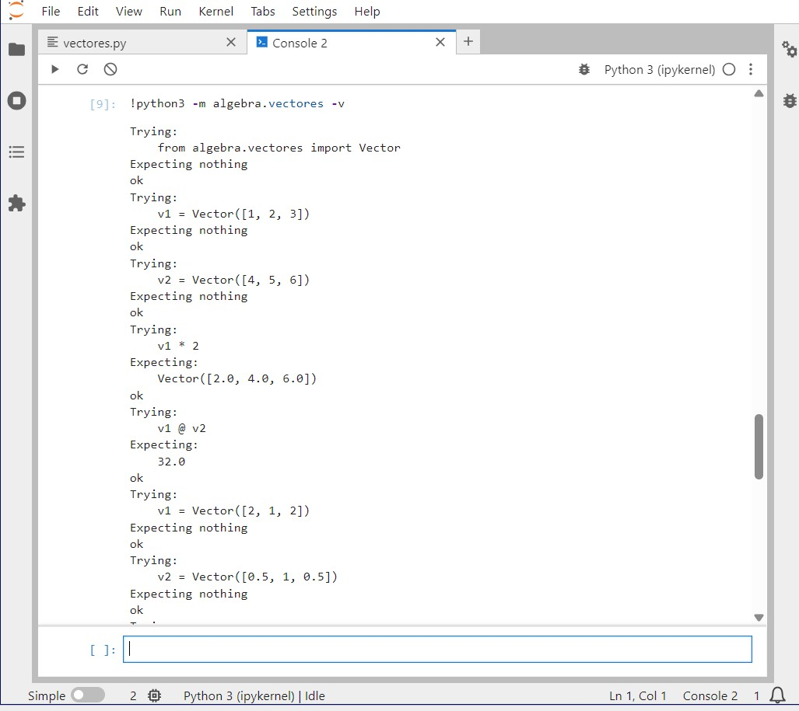
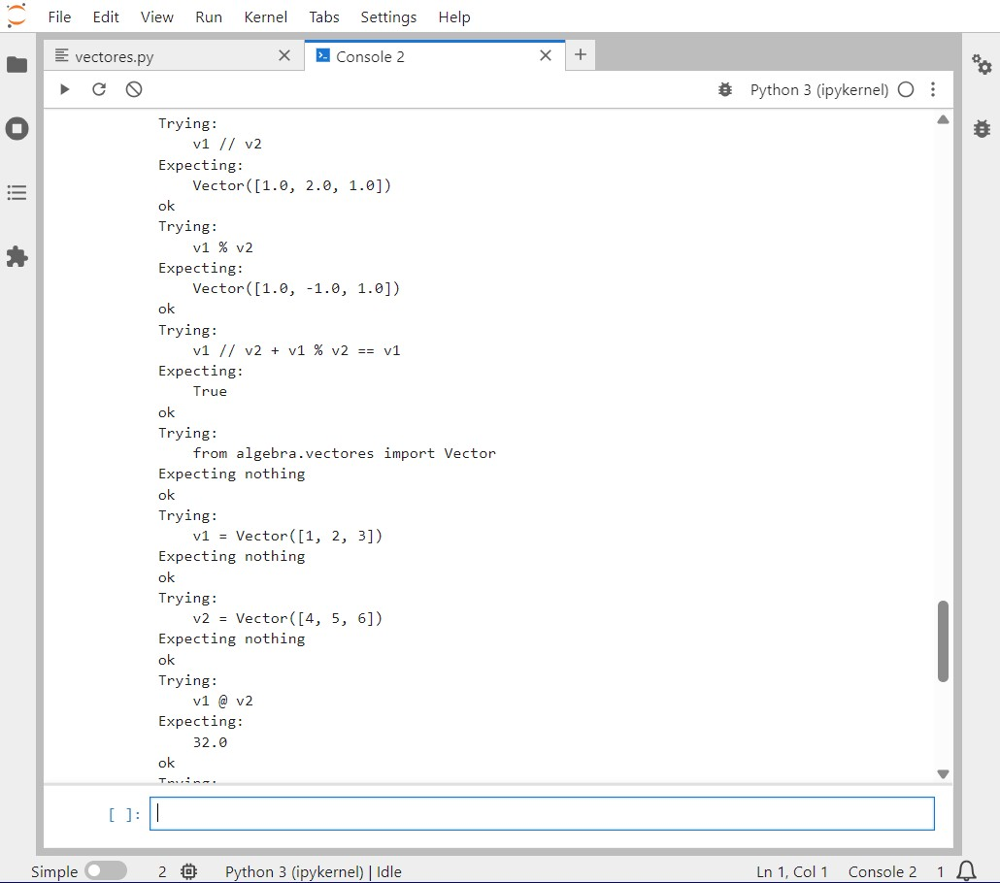
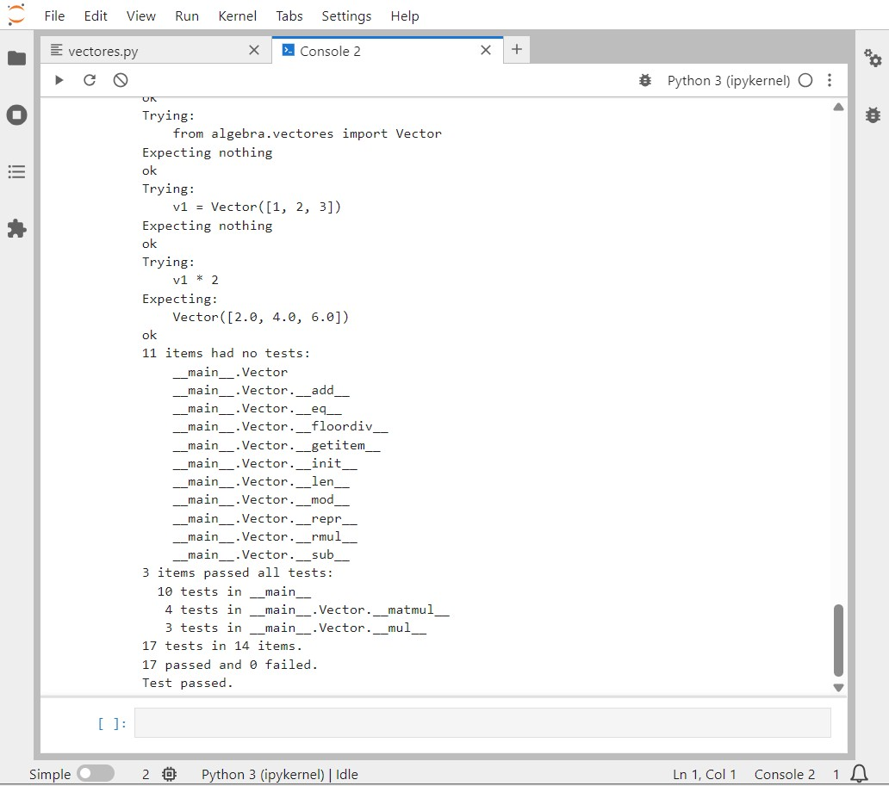

# Tercera tarea de APA: Multiplicación de vectores y ortogonalidad

## Nom i cognoms

> [!Important]
> Introduzca a continuación su nombre y apellidos:
>
> Martina Vermiglio Mas

## Aviso Importante

> [!Caution]
>
> 
> El objetivo de esta tarea es programar en Python usando el pardigma de la programación
> orientada a objeto. Es el alumno quien debe realizar esta programación. Existen bibliotecas
> que, si lugar a dudas, lo harán mejor que él, pero su uso está prohibido.
>
> ¿Quiere saber más?, consulte con el profesorado.
  
## Fecha de entrega: 6 de abril a medianoche

## Clase Vector e implementación de la multiplicación de vectores

El fichero `algebra/vectores.py` incluye la definición de la clase `Vector` con los
métodos desarrollados en clase, que incluyen la construcción, representación y
adición de vectores, entre otros.

Añada a este fichero los métodos siguientes, junto con sus correspondientes
tests unitarios.

### Multiplicación de los elementos de dos vectores (Hadamard) o de un vector por un escalar

- Sobrecargue el operador asterisco (`*`, correspondiente a los métodos `__mul__()`,
  `__rmul__()`, etc.) para implementar el producto de Hadamard (vector formado por
  la multiplicación elemento a elemento de dos vectores) o la multiplicación de un
  vector por un escalar.

  - La prueba unitaria consistirá en comprobar que, dados `v1 = Vector([1, 2, 3])` y
    `v2 = Vector([4, 5, 6])`, la multiplicación de `v1` por `2` es `Vector([2, 4, 6])`,
    y el producto de Hadamard de `v1` por `v2` es `Vector([4, 10, 18])`.

- Sobrecargue el operador arroba (`@`, multiplicación matricial, correspondiente a los
  métodos `__matmul__()`, `__rmatmul__()`, etc.) para implementar el producto escalar
  de dos vectores.

  - La prueba unitaria consistirá en comprobar que el producto escalar de los dos
    vectores `v1` y `v2` del apartado anterior es igual a `32`.

### Obtención de las componentes normal y paralela de un vector respecto a otro

Dados dos vectores $v_1$ y $v_2$, es posible descomponer $v_1$ en dos componentes,
$v_1 = v_1^\parallel + v_1^\perp$ tales que $v_1^\parallel$ es tangencial (paralela) a
$v_2$, y $v_1^\perp$ es normal (perpendicular) a $v_2$.

> Se puede demostrar:
>
> - $v_1^\parallel = \frac{v_1\cdot v_2}{\left|v_2\right|^2} v_2$
> - $v_1^\perp = v_1 - v_1^\parallel$

- Sobrecargue el operador doble barra inclinada (`//`, métodos `__floordiv__()`,
  `__rfloordiv__()`, etc.) para que devuelva la componente tangencial $v_1^\parallel$.

- Sobrecargue el operador tanto por ciento (`%`, métodos `__mod__()`, `__rmod__()`, etc.)
  para que devuelva la componente normal $v_1^\perp$.

> Es discutible esta elección de las sobrecargas, dado que extraer la componente
> tangencial no es equivalente a ningún tipo de división. Sin embargo, está
> justificado en el hecho de que su representación matemática es dos barras
> paralelas ($\parallel$), similares a las usadas para la división entera (`//`).
>
> Por otro lado, y de manera *parecida* (aunque no idéntica) al caso de la división
> entera, las dos componentes cumplen: `v1 = v1 // v2 + v1 % v2`, lo cual justifica
> el empleo del tanto por ciento para la componente normal.

- En este caso, las pruebas unitarias consistirán en comprobar que, dados los vectores
  `v1 = Vector([2, 1, 2])` y `v2 = Vector([0.5, 1, 0.5])`, la componente de `v1` paralela
  a `v2` es `Vector([1.0, 2.0, 1.0])`, y la componente perpendicular es `Vector([1.0, -1.0, 1.0])`.

### Entrega

#### Fichero `algebra/vectores.py`

- El fichero debe incluir una cadena de documentación que incluirá el nombre del alumno
  y los tests unitarios de las funciones incluidas.

- Cada función deberá incluir su propia cadena de documentación que indicará el cometido
  de la función, los argumentos de la misma y la salida proporcionada.

- Se valorará lo pythónico de la solución; en concreto, su claridad y sencillez, y el
  uso de los estándares marcados por PEP-ocho.

  

#### Ejecución de los tests unitarios

A continuación se muestran las capturas de pantalla que muestran el resultado de ejecutar el
fichero `algebra/vectores.py`:

#### Código desarrollado

'''python
"""
vectores.py: modulo hecho para el manejo de vectores 
programa hecho por martina vermiglio mas 

tests unitarios globales:
>>> from algebra.vectores import Vector
>>> v1 = Vector([1, 2, 3])
>>> v2 = Vector([4, 5, 6])
>>> v1 * 2
Vector([2.0, 4.0, 6.0])
>>> v1 @ v2
32.0
>>> v1 = Vector([2, 1, 2])
>>> v2 = Vector([0.5, 1, 0.5])
>>> v1 // v2
Vector([1.0, 2.0, 1.0])
>>> v1 % v2
Vector([1.0, -1.0, 1.0])
>>> v1 // v2 + v1 % v2 == v1
True
"""

class Vector:
    """clase que define un vector de n componentes y sus operaciones"""

    def __init__(self, data):
        """constructor que inicializa el vector con una lista de valores"""
        self.data = [float(x) for x in data]

    def __len__(self):
        """devuelve la longitud del vector"""
        return len(self.data)

    def __getitem__(self, index):
        """permite acceder a los elementos por índice"""
        return self.data[index]

    def __repr__(self):
        """representacion textual del vector"""
        return f"Vector({self.data})"

    def __add__(self, other):
        """suma de dos vectores"""
        return Vector([a + b for a, b in zip(self, other)])

    def __sub__(self, other):
        """resta de dos vectores (necesario para el operador %)"""
        return Vector([a - b for a, b in zip(self, other)])

    def __eq__(self, other):
        """compara si dos vectores son iguales (necesario para el test final)"""
        return self.data == other.data

    def __mul__(self, other):
        """
        producto de hadamard (elemento a elemento) o por un escalar
        >>> from algebra.vectores import Vector
        >>> v1 = Vector([1, 2, 3])
        >>> v1 * 2
        Vector([2.0, 4.0, 6.0])
        """
        if isinstance(other, (int, float)):
            return Vector([a * other for a in self.data])
        return Vector([a * b for a, b in zip(self, other)])

    def __rmul__(self, other):
        """multiplicación por la derecha (escalar * vector)"""
        return self.__mul__(other)

    def __matmul__(self, other):
        """
        producto escalar de dos vectores usando el operador @
        >>> from algebra.vectores import Vector
        >>> v1 = Vector([1, 2, 3])
        >>> v2 = Vector([4, 5, 6])
        >>> v1 @ v2
        32.0
        """
        return sum(a * b for a, b in zip(self, other))

    def __floordiv__(self, other):
        """
        devuelve la componente tangencial de self respecto a other
        fórmula: v1|| = ((v1 @ v2) / (v2 @ v2)) * v2
        """
        escalar = (self @ other) / (other @ other)
        return other * escalar

    def __mod__(self, other):
        """
        devuelve la componente normal de self respecto a other
        fórmula: v1_normal = v1 - v1||
        """
        return self - (self // other)

if __name__ == "__main__":
    import doctest
    doctest.testmod(verbose=True)

#### Subida del resultado al repositorio GitHub y *pull-request*

La entrega se formalizará mediante *pull request* al repositorio de la tarea.

El fichero `README.md` deberá respetar las reglas de los ficheros Markdown y
visualizarse correctamente en el repositorio, incluyendo la imagen con la ejecución de
los tests unitarios y el realce sintáctico del código fuente insertado.
